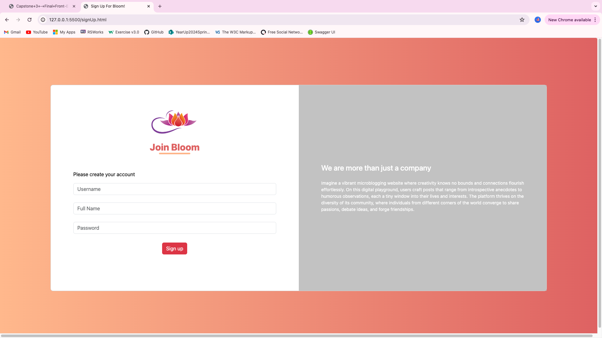
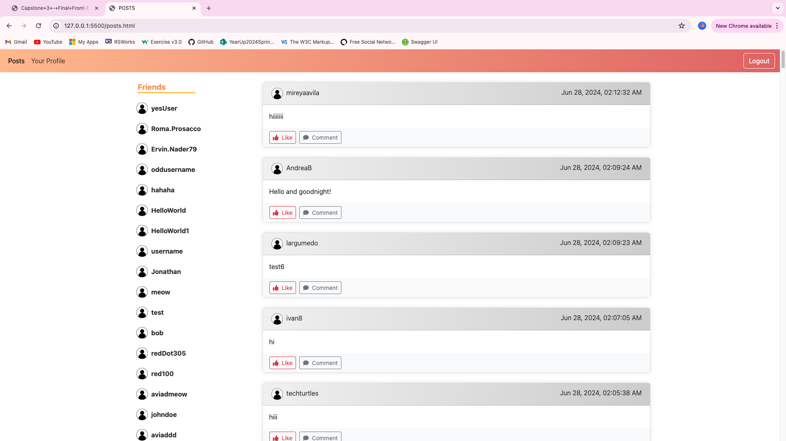
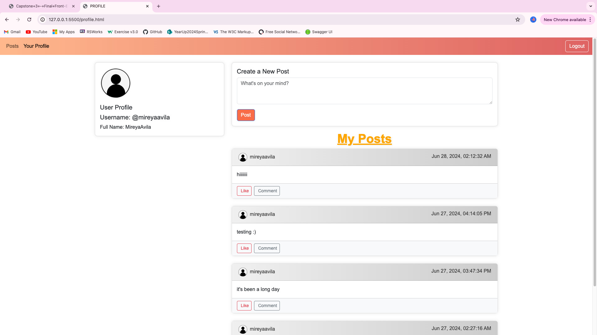

# Enjoy the Microblog Project and the MicroblogLite API!

Don't forget to read the [*MicroblogLite* API docs](http://microbloglite.us-east-2.elasticbeanstalk.com/docs) and experiment with the API in *Postman!*

# Welcome to Bloom ! 

## Overview
I was assign to create a mcicroblog that had atleast four pages. Those pages are a login page, sign up page, profile page, and posts page. For the sign up page I kept it simple with it only asking the user to create a username, enter thier full name and create a password. After creating an acocunt you would see a link that takes you to the login page. The login page asks for the username and password to log in then you are taken to the post page. The post page shows all posts that other users and yourself have created. It has a navbar as well that provides you the link to your profile page. This profile pages shows are the posts from the current user and allows them to create a new post. After clicking to create a new post you recieve an alert which then takes you directly to the post page. Both post page and the profile page required the user to log in. If no user is logged in then it takes you to the login page so you get authorization to view the pages.

## Most Challenging Part
For me the most challenging part was my profile page. I had many trail and errors creating the functions so all parts of the page can work how they needed. For the function that creates the post and then sends it the post page to display would have to be the toughest function I made. I did like the fact that I was able to create a alert saying that a new post was created then take the user straight to the posts page. I did use outside resources for some of my functions siince some stuff was still very new to me. The amount of research I had to look through helped me understand the concepts more. I used a couple of different fetch requests for this single page which was confusing at first but then I saw how everything clicked together. 

## images of website pages 

